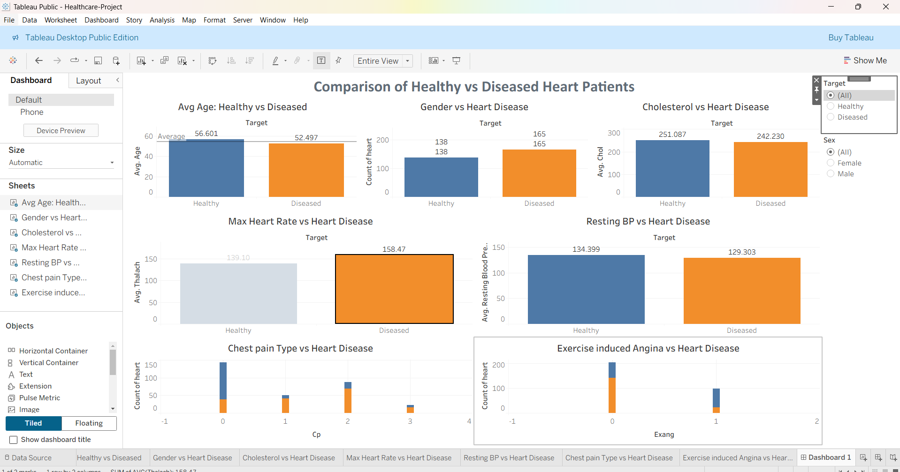

# Cardiovascular Disease Analysis and Prediction

## Project Overview
Cardiovascular diseases (CVD) are one of the leading causes of death globally. Early identification of risk factors can help prevent severe outcomes such as heart attacks. 
This project analyzes patient health data to identify the key factors that contribute to cardiovascular disease and builds a predictive model to determine the likelihood of heart disease occurrence.
The analysis includes exploratory data analysis (EDA), statistical insights, machine learning modeling using Logistic Regression, and an interactive dashboard built in Tableau to visualize the findings.

---

## Problem Statement
The dataset contains medical and demographic information about patients that may influence cardiovascular health. The objective of this project is to:

- Identify the factors contributing to heart disease.
- Perform exploratory data analysis on the dataset.
- Build a predictive model to detect heart disease.
- Visualize insights using an interactive Tableau dashboard.

---

## Dataset Information
The dataset contains **4000+ patient records** and **14 medical attributes** related to cardiovascular health.

### Key Features

- Age
- Gender
- Chest Pain Type
- Resting Blood Pressure
- Cholesterol Level
- Fasting Blood Sugar
- Resting ECG
- Maximum Heart Rate Achieved
- Exercise Induced Angina
- ST Depression
- Slope of ST Segment
- Number of Major Vessels
- Thalassemia
- Target (Heart Disease Presence)

---

## Tools and Technologies

- Python
- Pandas
- NumPy
- Matplotlib
- Seaborn
- Scikit-learn
- Tableau

---

## Data Analysis Process

### 1. Data Inspection and Cleaning
- Checked dataset structure
- Identified missing values
- Removed duplicates
- Handled missing data appropriately

### 2. Exploratory Data Analysis (EDA)
The following analyses were performed:

- Distribution of cardiovascular disease across age groups
- Gender-wise composition of patients
- Impact of resting blood pressure on heart disease
- Relationship between cholesterol levels and heart disease
- Analysis of exercise-induced angina
- Relationship between thalassemia and cardiovascular disease

### 3. Feature Relationships
Pair plots and correlation analysis were used to understand relationships between different medical attributes.

---

## Predictive Modeling

A **Logistic Regression model** was used to predict the likelihood of cardiovascular disease.

### Steps performed:

- Train-test data split
- Model training using Logistic Regression
- Model prediction
- Performance evaluation using Confusion Matrix

---

## Tableau Dashboard

An interactive Tableau dashboard was created to visualize the key insights from the dataset.

The dashboard highlights:

- Comparison between healthy vs diseased patients
- Age distribution
- Gender composition
- Cholesterol impact
- Maximum heart rate analysis
- Chest pain analysis

---

## Dashboard Preview

---

## Key Insights

- Age and cholesterol levels show strong correlation with cardiovascular disease.
- Exercise-induced angina is a major indicator of heart disease.
- Patients with abnormal thalassemia levels show higher risk.
- Logistic regression successfully predicts the likelihood of heart disease.

---

## Conclusion

The analysis identified several medical factors strongly associated with cardiovascular disease, including age, cholesterol levels, exercise-induced angina, and thalassemia. 

The logistic regression model demonstrated that these variables can effectively help predict the likelihood of heart disease, providing valuable insights for early diagnosis and prevention.

